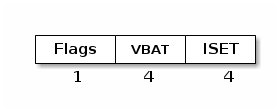

Syslink is the protocol used between the STM32 and NRF51 in Crazyflie
2.0. It handles low level communication on the serial port.

Physical format
---------------

In Crazyflie 2.0 syslink is transmitted on serial port at 1MBaud. It is
a packet-based protocol.

      +-----------+------+-----+=============+-----+-----+
      |   START   | TYPE | LEN | DATA        |   CKSUM   |
      +-----------+------+-----+=============+-----+-----+

-   **START** is 2 bytes constant, 0xBC 0xCF.
-   **TYPE** defines the type of packet
-   **LENGTH** and type are uint8\_t, defines the data length.
-   **CKSUM** is 2 bytes Fletcher 8 bit checksum. See
    [rfc1146](https://tools.ietf.org/html/rfc1146). calculated with
    TYPE, LEN and DATA.

**Note**: Unless otherwise specified, all numbers are encoded in
low-endian form.

Packet types
------------

Packet types is defined in the syslink.h file (in the
[stm32](https://github.com/bitcraze/crazyflie-firmware/blob/crazyflie2/hal/interface/syslink.h)
and
[nrf51](https://github.com/bitcraze/crazyflie2-nrf-firmware/blob/master/interface/syslink.h)
firmware).

Packets are organized in groups to ease routing in firmwares:

|  Group  | Name                             | Description|
|  -------| ---------------------------------| ---------------------------------------------------|
|  0x00   | [RADIO](#radio_packets)          | Radio related packets. For data and configuration|
|  0x10   | [PM](#power_management_packets)  | Power management|
|  0x20   | [OW](#one_wire_packets)          | One wire memory access|

A packet type has its group in the high nibble and the type in the low
nibble. In the rest of the page packet type are written with group.

Radio packets
-------------

### RADIO\_RAW

-   **Type**: 0x00
-   **Data format**: Raw radio packet as sent in the air

This packet carries the raw radio packet. The NRF51 acts as a radio
bridge. Because the NRF51 does not have much memory and the STM32 is
capable of bursting a lot of data a flow control rules has been made:
The STM32 is allowed to send a RADIO\_RAW packet only when one
RADIO\_RAW packet has been received.

The NRF51 is regularly sending CRTP NULL packet or empty packets to the
STM32 to get the communication working both ways.

\<WRAP round info \> ***Note*** So far RADIO\_RAW is the only syslink
packet that has flow control constrain, all other packets can be sent
full duplex at any moment. \</WRAP\>

### RADIO\_CHANNEL

-   **Type**: 0x01
-   **Data format**: One uint8\_t indicating the radio channel

This packet is used only in ESB mode.

Packet sent to the NRF51 to set the radio channel to use. The NRF51 then
send back the same packet to confirm that the setting has been done.

NRF51 radio channel are spaced by 1MHz from 2400MHz to 2525MHz.

### RADIO\_DATARATE

-   **Type**: 0x02
-   **Data format**: One uint8\_t indicating the radio datarate.

This packet is used only in ESB mode.

Packet sent to the NRF51 to set the radio datarate to use. The NRF51
then send back the same packet to confirm that the setting has been
done.

Possible datarate:

 | Value  | Datarate|
 | -------| ----------|
 | 0      | 250Kbps|
 | 1      | 1Mbps|
 | 2      | 2Mbps|

### RADIO\_CONTWAVE

-   **Type**: 0x03
-   **Data format**: One uint8\_t at 0 for disable, \>0 for enable.

Allows to put the nRF51 in continuous wave mode. If enabled the nRF51
will disable Bluetooth advertising and set its radio to emit a
continuous sinus wave at the currently set channel frequency.

\<WRAP center round important\> ***Warning*** Continuous wave is a test
mode used, among other thing, during manufacturing test. It will affect
other wireless communication like Wifi and should be used with care in a
test environment \</WRAP\>

### RADIO\_RSSI

-   **Type**: 0x03
-   **Data format**: One uint8\_t indicating the last received pachet
    RSSI

This packet is meaningful only in ESB mode.

Packet sent 100 times per seconds to the STM32. Contains the power value
of the latest received packet. The value is the same as reported by the
NRF51: between 40 and 100 which means measurement of -40dBm to -100dBm.

Power management packets
------------------------

### SYSLINK\_PM\_ONOFF\_SWITCHOFF

-   **Type**: 0x11
-   **Format**: No data

When sent by the STM32 to the NRF51, the NRF51 switch OFF the system and
goes in deep sleep.

### SYSLINK\_PM\_BATTERY\_STATE

-   **Type**: 0x13
-   **Format**:

-   **Flags**: Bit0: Charging. Bit1: USB Powered.
-   **VBAT**: IEEE single float. Battery voltage.
-   **ISET**: IEEE single float. Charge current in milli-Ampers.

The SYSLINK\_PM\_BATTERY\_STATE packet is sent 100 times per seconds to
the STM32.

One Wire packets
----------------
